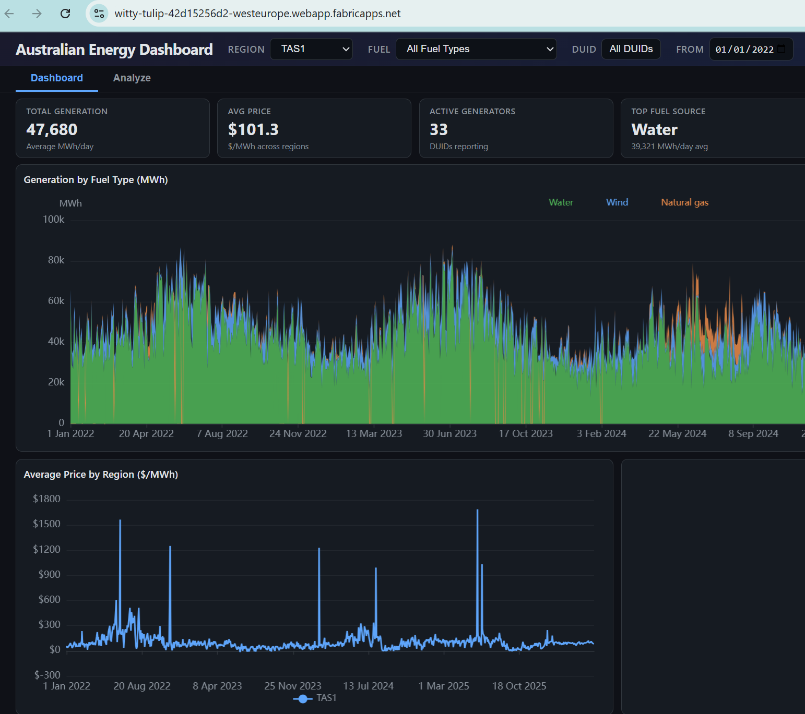

# rayfin-duckdb-wasm

An experiment showing that you can run a **DuckDB-WASM** dashboard on **Microsoft Fabric** via
[Rayfin](https://www.npmjs.com/package/@microsoft/rayfin-cli) static hosting, and have the browser read
its data **directly from OneLake** — no backend, no server-side query layer.



The sample dashboard is the [NemTracker](https://nemtracker.github.io/) Australian
energy-market app (ECharts + DuckDB-WASM). All it does is download a single consolidated `data.duckdb`
into the browser (OPFS) and query it with DuckDB-WASM; here that file is served from OneLake instead of
from the app's own origin.

## How it works

- **Hosting:** `build.mjs` copies `site/` → `dist/`, and `rayfin up` deploys `dist/` to Fabric static
  hosting. No bundler — the dashboard is a single `site/index.html` that loads ECharts, DuckDB-WASM and
  MSAL from a CDN.
- **Data:** the dashboard reads one `data.duckdb` (~440 MB) from `<oneLakeBase>/data/data.duckdb` over HTTPS,
  downloads it whole into OPFS, and ATTACHes it. OneLake serves it with permissive **CORS** and honors
  **ETag / conditional GETs**, so an unchanged file is a `304` (reuse the OPFS copy). Because the file is
  **live** (regenerated every few minutes), most refreshes change the ETag and **re-download the whole
  ~440 MB** — an accepted trade-off for keeping everything in a single file. The dashboard also has no
  pre-aggregated daily tables in the file, so it **materializes small daily rollups once at load** to keep
  wide-range (daily-grain) charts fast over the 45 M-row 5-min fact.
- **Auth:** OneLake needs an Entra token. The browser gets one via **MSAL.js as a public SPA client
  (PKCE, no secret)** — `acquireTokenSilent` → `ssoSilent` → popup. The token is sent as
  `Authorization: Bearer …` on each `fetch`. No `azure` DuckDB extension required — plain `httpfs`.

```
browser (DuckDB-WASM)  ──fetch + Bearer──►  OneLake (data.duckdb)
        ▲
        └── MSAL.js (Entra SPA, PKCE) → storage.azure.com token
```

## Setup

You need a Fabric workspace with a lakehouse and an Entra **SPA app registration** (public client, with
the delegated **Azure Storage `user_impersonation`** permission). Put its client ID + tenant ID, and your
OneLake base URL, into `site/config.js` (`cp site/config.example.js site/config.js`).

Everything else is Rayfin — see the [Rayfin documentation](https://learn.microsoft.com/fabric/embedded/rayfin/overview) for full details:

```bash
rayfin login      # sign in to Fabric
rayfin up         # build (build.mjs) + deploy dist/ to Fabric static hosting; prints the hosting URL
```

`rayfin.yml` is already wired (`data.enabled: false`, `staticHosting.buildCommand: npm run build:fabric`),
so it's just `rayfin up`. Upload your `data.duckdb` to `<oneLakeBase>/data/data.duckdb` in the lakehouse
(the dashboard fetches it from exactly that path — adjust the path in `site/index.html` if you place it
elsewhere), add the hosting URL that `rayfin up` prints to your Entra app's SPA redirect URIs, and open it
in its own tab.

## limitations

- **Open it standalone, not inside the Fabric portal iframe.** Acquiring an Entra token in the embedded
  iframe is blocked by the browser (sandbox + storage partitioning), so the app shows an "open in new
  tab" prompt there. OneLake-direct works from a top-level tab.
- **Single-threaded** DuckDB-WASM. Multi-threading needs cross-origin isolation (COOP/COEP), which
  severs the MSAL popup — don't know how to make it work.
- No data is committed here; it lives in your OneLake. No secrets are committed — the client ID/tenant
  live only in the gitignored `site/config.js` (and are public-by-design in any deployed SPA anyway).
- **File format:** we use DuckDB's native `.duckdb` format for performance. Parquet files over HTTPS are also supported by DuckDB-WASM, and Iceberg is supported too — but the `azure` extension's `abfss://` scheme does not work in WASM, so OneLake access goes through plain HTTPS fetch with a Bearer token (as done here) rather than native Azure filesystem URIs.
- Want it without a sign-in? Set `oneLakeBase: ""` in `config.js` and put `data.duckdb` at `site/data/data.duckdb`
  so it's served same-origin (no token needed). Handy for a quick local check of query changes — but don't
  commit it (`*.duckdb` is gitignored).

## Why Rayfin and not GitHub Pages?

GitHub Pages is free and would serve the static files just fine — but it's public. Anyone on the internet can reach it. Rayfin gives you **Entra authentication out of the box**: only users in your tenant can open the app at all, with no extra infrastructure, no Azure AD App Proxy, and no custom auth middleware. One `rayfin up` and the app is tenant-gated.
